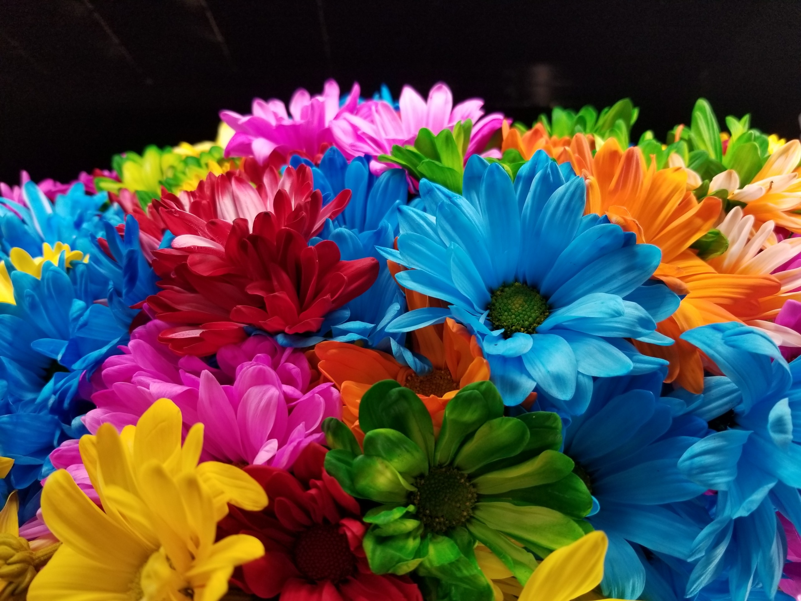
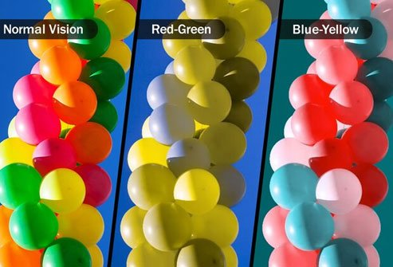

Project 2 - Stats R Us
================

*Author: Holly Cui, Sophie Dalldorf, Kate Neal, Parker Dingman*

### A Shiny App Focusing on Color Blindness
Navigate to our final website at ⬇️: 

https://kateneal.shinyapps.io/exploring-colorblindness/ 

Write-up page can be found in the last tab of the website. 

All codes behind the scene are under `App` folder ⬇️: 

https://github.com/vizdata-f21/project-2-stats_r_us/blob/main/App/app.R 

### Table of contents

- **Proposal**

Please find the real `Proposal.rmd` under this folder along with the `Proposal.md` for reading conveniency. We have most of the project details listed here. 

- **App**

The major Shiny-building rmd can be found here. We will be working together to write the codes. Individual rmds may also be added here later if we need basic ggplots for our website in terms of analyzing colorblindness statistics. 

- **Images**

Since we want to build a function that can let users choose different images to apply the filters, we need to pre-gather some images and upload to our app. All the qualified images, either for testing or building purpose, will be uploaded here. 

### Background Information
 

What do you see from this image? 
Flowers, crowded, and colorful... 

Deemed to be easily pointed out by all, “**colorful**”, however, is not always a simple trait for some. Here, we mean people suffering from colorblindness in their daily life. 

According to recent statistics, color blindness (colour vision deficiency, CVD, or dichromacy) affects approximately 1 in 12 men (8%) and 1 in 200 women in the world. Globally, there are approximately 300 million people with colour blindness, almost the same number of people as the entire population of the USA. These staggering numbers make us wonder how people with colorblindness perceive and interact with their surrounding environments, what is the world in their eyes, and how we can help using knowledge regarding color scales manipulations we learned from class this semester. 

Instead of making something distant from daily life, our group decided to create an interactive Shiny app to help people understand color blindness, test color perceptions, and “filter” photos to show different types of color deficiency. Furthermore, we will create our own website that not only features the app, but also educational pages including  basic data visualizations and analysis using datasets related to current statistics of colorblindness to engage users and gather attention. 

To help with understanding our projects, we are providing some useful information below regarding different types of colorblindness: 

The most common form of colour blindness is known as ‘**red/green colour blindness**’. Most colour blind people have one type of this. Being ‘red/green colour blind’ doesn’t mean people with it mix up red and green only, it means they can mix colours which have some red or green as part of the whole colour. 

There are four types under this category: 

-   **Protanopia**: people won’t see reds or greens properly. Colors that contain red will also look different. 

-   **Deuteranopia**: green-responsive photoreceptors aren’t functioning. 

-   **Protanomaly**: red may appear as dark gray and every color that contains red may be less bright.

-   **Deuteranomaly**: green-responsive cones don’t work as they should. It’s the most common form of color blindness. 

Moreover, we have ‘**blue-yellow color deficiency**’, where there are two types under this category:

-   **Tritanopia**: no blue-responsive cone cells. 

-   **Tritanomaly**: blue-responsive cone cells work, but not as well as a full color-sighted person.

 

A full colorblindness is called **monochromacy**, which states that their vision might be a lot like “watching a black and white television”. 

For more information, please refer to this website regarding details about what colors people with colorblindness will actually see: https://my.clevelandclinic.org/health/diseases/11604-color-blindness 

### Citations
https://my.clevelandclinic.org/health/diseases/11604-color-blindness 

https://www.allaboutvision.com/conditions/color-blindness/types-of-color-blindness/ 

